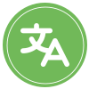

<p></p>

<h1>Switcher for Craft CMS</h1>


## Requirements

This plugin requires Craft CMS 4.x


## Installation

To install the plugin, follow these instructions.

1. Open your terminal and go to your Craft project:

        cd /path/to/project

2. Then tell Composer to load the plugin:

        composer require ianreid/switcher -w && php craft plugin/install switcher


## Overview

Switcher for Craft CMS is a plugin that adds a Twig function to output a site switcher on your website. This switcher can be used to output sites from the current group or all groups. The plugin is compatible with Craft CMS 4.x.


## Twig function

### langSwitcher()

```

```

#### Parameters

| Parameters    | Type | Default | Description |
| :-------- | :------- | :------- | :------- |
| source  | Element or Array  | null | An Element or an array to get the sites from. |
| removeCurrent | Bool     | true | Boolean value that determines whether the current site should be removed from the output. |
| onlyCurrentGroup    | Bool    | true | Boolean value that determines whether only sites from the current group should be outputted. |
| redirectHomeIfMissing    | Bool    | false | Boolean value that determines whether to redirect to the home page if a site is missing. |

#### Returns

The function returns an array of items with the following keys: "url" and "site". The "url" key is the URL of the site, and the "site" key is the site model.

```
array [
  0 => array [
    "url" => "http://yoursite:8888/uri"
    "site" => craft\models\Site {}
  ]
  1 => array [
    "url" => "http://yoursite:8888/en/uri"
    "site" => craft\models\Site {}
  ]
]
```

#### Basic usage


```



   
      <a 
         href="{{ url(item.url) }}" 
         hreflang="{{item.site.language}}" 
         lang="{{item.site.language}}" 
      >
         {{ item.site.language }}
      </a>
   

```

##### Grouping sites by groups

```




   

   

      <h3 class="text-9 text-blue-500">{{ group }}</h3>
      
         <a 
            href="{{ url(item.url) }}" 
            hreflang="{{item.site.language}}" 
            lang="{{item.site.language}}" 
         >
            {{ item.site.language }}
         </a>
      

   

```


#### Usage on a per-template basis

You can also set the source in your template. __This is probably the way that you want to implement it on large projects__.

In the following example, you can set the `langSource` variable in your template. If not defined, it will fallback to `entry`.

##### Add this code to your navbar or main layout

```




   
      <a 
         href="{{ url(item.url) }}" 
         hreflang="{{item.site.language}}" 
         lang="{{item.site.language}}" 
      >
         {{ item.site.language [0:2]|capitalize }} {# the 2 first letters only #}
      </a>
   

```

##### In your section template, you can now do this :

For any `craft\base\Element` other than `Entry` (the default in the previous example)

```

```

```

```


For an array (ex: with custom routes)

```

```


## Hreflang in head

The plugin also provides the ability to easily set the alternate languages. It can be useful for the `og:locale:alternate` property.

### langSwitcher()

```

```

#### Parameters

| Param    | Type | Default | Description |
| :-------- | :------- | :------- | :------- |
| onlyCurrentGroup    | Bool    | true | Boolean value that determines whether only sites from the current group should be outputted |

##### Usage for the og:locale:alternate in `<head>`

```
<meta property="og:locale" content="{{ currentSite.language }}">


   
      <meta property="og:locale:alternate" content="{{ site.language }}">
   


```

#### Returns

This function returns an array of `craft\models\Site` without the current one.

---


Brought to you by [Ian Reid Langevin](https://www.reidlangevin.com)
